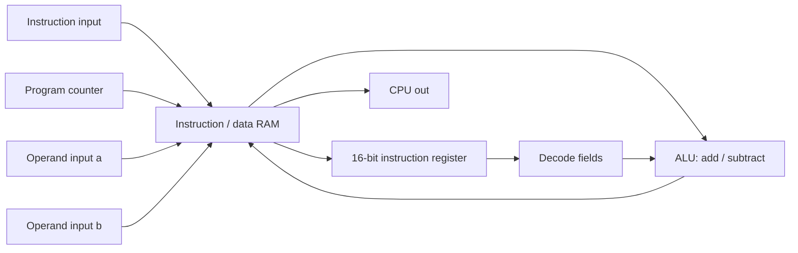

# 16-Bit RISC Processor

A Verilog HDL project that builds a simple RISC-style processor from digital
logic building blocks. The repository starts with gates, multiplexers,
demultiplexers, adders, and subtractors, then combines them into registers,
RAM blocks, a program counter, an ALU, and a CPU wrapper.

The current CPU implementation uses a 16-bit instruction register with a
32-bit datapath for operands, memory words, ALU results, and the program
counter.

## Repository Structure

| Path | Description |
| --- | --- |
| `set1/` | Basic combinational circuits: gates, 16-bit gates, muxes, demuxes, and testbenches. |
| `set2/` | Arithmetic building blocks: half/full adders, half/full subtractors, 16-bit adder/subtractor modules, and testbenches. |
| `Hardware lab-assg5/` | Main processor components: CPU, ALU, PC, RAM, registers, flip-flops, mux/demux modules, arithmetic helpers, and component testbenches. |
| `functions.asm` | Separate x86 assembly utility routines for printing, newline, exit, string length, integer parsing, and integer printing. |
| `README.md` | Project overview and usage notes. |

## Main Hardware Modules

| Module | File | Purpose |
| --- | --- | --- |
| `CPU` | `Hardware lab-assg5/CPU.v` | Fetches a 16-bit instruction from RAM through the program counter, decodes operand/result fields, drives the ALU, and writes the result back to RAM. |
| `ALU` | `Hardware lab-assg5/ALU.v` | Selects between 32-bit addition and subtraction using a 1-bit select signal. |
| `PC` | `Hardware lab-assg5/PC.v` | 32-bit program counter with reset, increment, and write/jump-style load controls. |
| `ram8` | `Hardware lab-assg5/RAM8.v` | 8-location RAM built from 32-bit registers, demuxes, muxing, and gate-level logic. |
| `ram16` | `Hardware lab-assg5/RAM16.v` | 16-location RAM composed from two `ram8` blocks. |
| `reg_32bit` | `Hardware lab-assg5/reg_32bit.v` | 32-bit register built from single-bit binary cells. |
| `adder_32` / `sub_32` | `Hardware lab-assg5/adder_32.v`, `Hardware lab-assg5/sub_32.v` | 32-bit ripple-carry addition and subtraction. |
| `multiply`, `divider`, `remainder` | `Hardware lab-assg5/` | Simple behavioral arithmetic helper modules. |

## CPU Data Flow



## Instruction Field Map

`CPU.v` currently decodes selected fields from the 16-bit instruction register:

| Bits | Current use |
| --- | --- |
| `[15:13]` | Reserved / unused in current CPU logic |
| `[12]` | ALU select: `0` selects addition, `1` selects subtraction |
| `[11]` | Reserved / unused |
| `[10:8]` | Destination RAM address for ALU write-back |
| `[7]` | Reserved / unused |
| `[6:4]` | RAM address used for operand `a` |
| `[3]` | Reserved / unused |
| `[2:0]` | RAM address used for operand `b` |

During execution, the CPU writes external operand inputs `a` and `b` into the
RAM addresses named by the instruction, reads them back into internal operands,
runs the selected ALU operation, and stores the ALU output at the destination
address.

## Requirements

Use any Verilog simulator that supports gate-level Verilog modules. The project
includes a ModelSim/Questa project file:

```text
Hardware lab-assg5/cpu.mpf
```

Common options:

- ModelSim or QuestaSim
- Icarus Verilog plus GTKWave

## Running Simulations

### ModelSim / QuestaSim

Open the ModelSim project file or compile from the command line:

```sh
cd "Hardware lab-assg5"
vlib work
vlog *.v
vsim work.PC_tb
run -all
```

To run a different component testbench, replace `PC_tb` with another testbench
module such as `RAM8_TB`, `RAM16_TB`, `reg_32bit_tb`, `mux_tb`, or
`demux_4way_tb`.

### Icarus Verilog

If you use Icarus Verilog, compile a selected top-level testbench:

```sh
cd "Hardware lab-assg5"
iverilog -s PC_tb -o pc_tb.out *.v
vvp pc_tb.out
```

The existing testbenches mostly rely on waveform inspection rather than
`$display` assertions, so a successful run may not print much output.

## Development Notes

- `Hardware lab-assg5/CPU_TB.v` is currently a placeholder and does not provide
  a complete CPU-level simulation.
- Several files include `.bak` backups from earlier lab iterations; the primary
  Verilog sources use the `.v` extension without `.bak`.
- The processor is best viewed as an educational hardware-lab implementation:
  it demonstrates how larger CPU pieces can be composed from small digital
  logic modules.

## Suggested Next Steps

- Add a complete `CPU_TB.v` that loads multiple instructions and checks ALU
  write-back behavior.
- Add `$display` or assertion-based checks to existing component testbenches.
- Document a formal instruction encoding once all opcode fields are finalized.
- Remove or archive `.bak` and simulator-generated files if they are no longer
  needed in source control.
